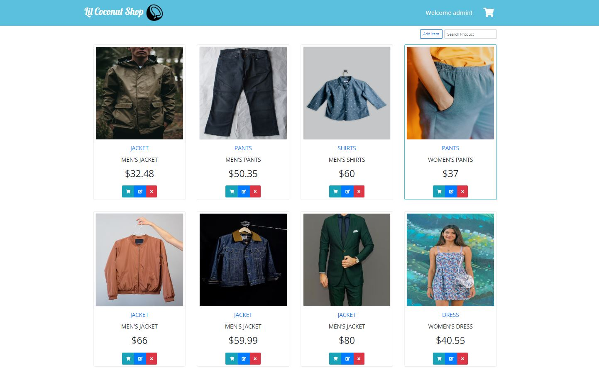
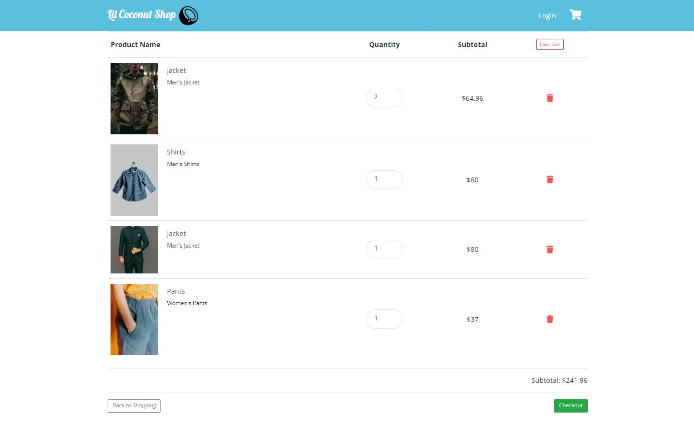

# Lil Coconut Shop
> Lil Coconut Shop is an e-commerce shopping website.

[![NPM Version][npm-image]][npm-url]


## Screenshots



## Tech/Framework used
<b>Front End</b>
* HTML/CSS/JS
* Angular
* Bootstrap 4.3
* Node.js 16.16.0

<b>Back End</b>
* Java 11
* MySQL 8

<b>Framework</b>
* Spring Boot
* Spring Security (JwtToken)
* Apache Maven
* JPA (Java Persistence API)
* Hibernate
* Docker

<b>Architecture</b>
* RESTful API
* MVC (Model-View-Controller)

## Development setup
* Download project
```sh
git clone https://github.com/MyungLee1992/shopping-website.git
```

* Back-End Project
```
open shoppingwebsite in IDE
mvn clean compile
run the application
```

* Front-End Project
```sh
cd shoppingwebsiteapp
ng serve
```

* Docker Environment
```sh
docker-compose up -d
```

<!-- Markdown link & img dfn's -->
[npm-image]: https://img.shields.io/npm/v/npm?style=flat-square
[npm-url]: https://www.npmjs.com/package/npm/v/8.11.0
